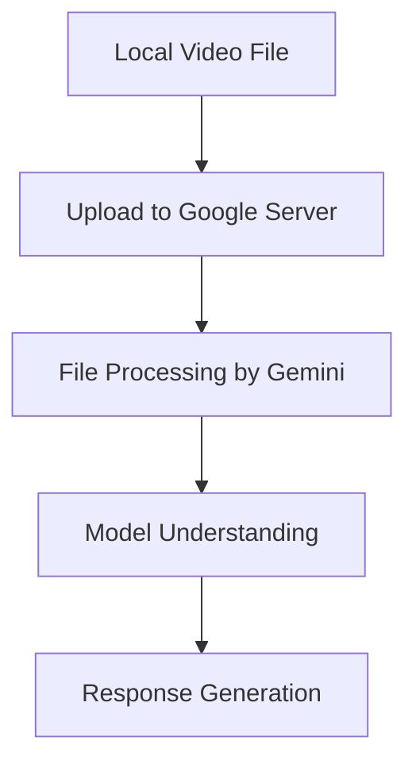
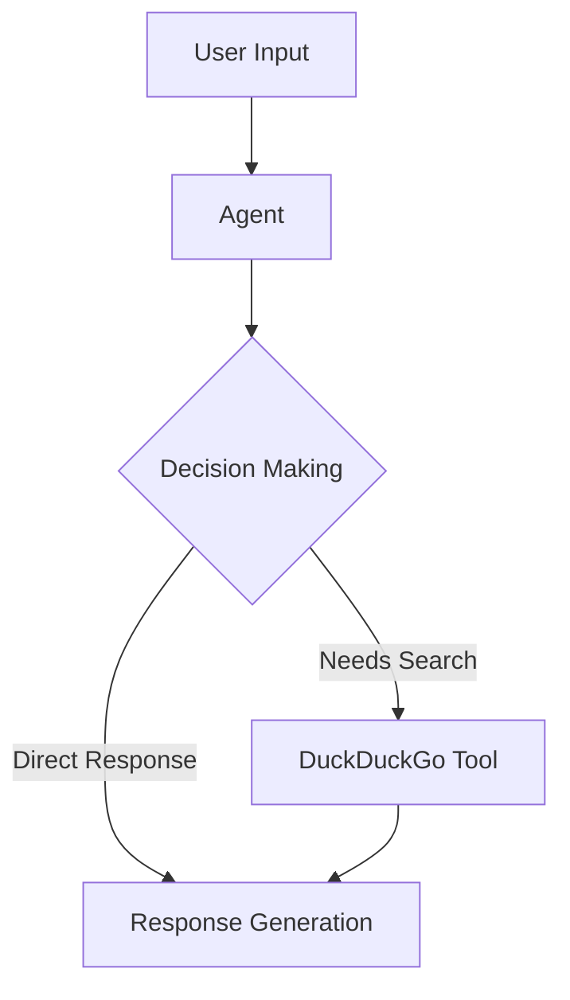
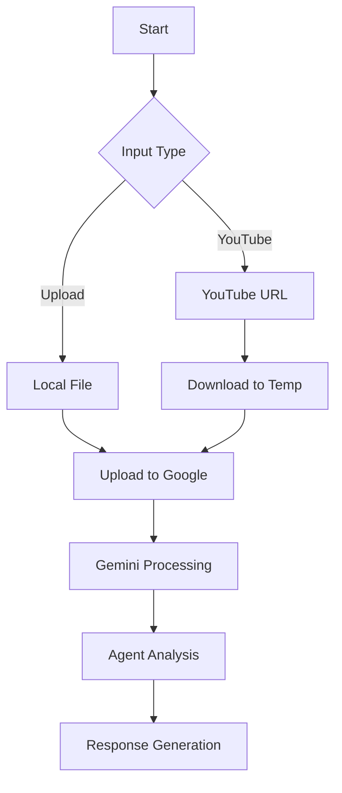

# Deep Dive: How the Video Analyzer Works Internally

## 1. File Processing Flow

### Why Upload to Google's Servers?



#### The Need for Server Upload
1. **Model Location**:
   - Gemini models run on Google's servers
   - They're too large to run locally
   - Need specialized hardware (TPUs/GPUs)

2. **File Processing**:
   - Local files cannot be directly accessed by Gemini
   - Need to be in Google's cloud environment
   - Ensures security and proper formatting

#### How File Upload Works
```python
# When you use upload_file:
processed_video = upload_file(video_path, mime_type="video/mp4")
```

1. **Process**:
   - File is chunked into pieces
   - Uploaded with unique identifier
   - Processed into model-compatible format
   - Returns a reference object

2. **Tracking**:
   ```python
   while processed_video.state.name == "PROCESSING":
       time.sleep(1)
       processed_video = get_file(processed_video.name)
   ```
   - Each file gets unique ID
   - ID tied to your API key
   - State tracked throughout processing

## 2. Agent Architecture

### Basic Agent Structure


### How the Agent Works

1. **Initialization**:
   ```python
   agent = Agent(
       name="Video AI Analyzer",
       model=Gemini(id="gemini-2.0-flash-exp"),
       tools=[DuckDuckGo()],
       markdown=True,
   )
   ```
   - Creates agent instance
   - Configures available tools
   - Sets up model connection

2. **Processing Flow**:
   ```python
   response = agent.run(analysis_prompt, videos=[processed_video])
   ```

   a. **Input Analysis**:
      - Agent receives prompt and video
      - Gemini processes video content
      - Understands user's question

   b. **Decision Making**:
      - Evaluates if web search needed
      - Determines response strategy
      - Chooses appropriate tools

   c. **Tool Usage**:
      - DuckDuckGo triggered for:
        - Context enrichment
        - Fact verification
        - Additional information

### DuckDuckGo Integration

1. **When It's Used**:
   - Reference checking
   - Current information needs
   - Context expansion

2. **Trigger Mechanism**:
   - Agent analyzes confidence level
   - Identifies knowledge gaps
   - Autonomously decides to search

Example:
```python
# Internal agent decision making (simplified)
if needs_additional_context:
    search_results = duckduckgo_tool.search(query)
    enhanced_response = combine_with_video_analysis(search_results)
```

## 3. Video Processing Architecture

### Complete Flow Diagram


### Processing Stages

1. **Input Handling**:
   ```python
   # For local files
   with tempfile.NamedTemporaryFile(delete=False, suffix='.mp4') as temp_video:
       temp_video.write(video_file.read())
   
   # For YouTube
   video_path = download_youtube_video(youtube_url)
   ```

2. **Google Server Upload**:
   ```python
   processed_video = upload_file(video_path, mime_type="video/mp4")
   ```
   - Creates secure upload channel
   - Handles file transfer
   - Manages processing state

3. **Gemini Processing**:
   - Converts video to model-readable format
   - Extracts frames and features
   - Builds understanding of content

4. **Agent Analysis**:
   ```python
   analysis_prompt = f"""
       Analyze the video for content and context.
       Respond to the following query: {user_query}
   """
   response = agent.run(analysis_prompt, videos=[processed_video])
   ```

## 4. Security and Data Handling

### File Management
1. **Temporary Files**:
   - Created for processing
   - Automatically cleaned up
   - Secure handling of data

2. **Server Storage**:
   - Files temporarily stored
   - Tied to API credentials
   - Automatically managed

### API Security
1. **Authentication**:
   - API key verification
   - Secure file transfer
   - Encrypted communication

2. **Data Privacy**:
   - Limited file retention
   - Secure processing
   - Access controls

## 5. Best Practices and Tips

### For Efficient Processing
1. Use appropriate file formats
2. Optimize video size
3. Clear, specific queries
4. Handle errors gracefully

### For Better Results
1. Frame questions clearly
2. Allow processing time
3. Check error messages
4. Monitor API usage

## 6. Common Issues and Solutions

### Processing Failures
1. **File Size Issues**:
   - Reduce video length
   - Lower resolution
   - Split large files

2. **Upload Errors**:
   - Check network connection
   - Verify API key
   - Confirm file format

3. **Analysis Errors**:
   - Clarify queries
   - Check video content
   - Verify processing status

Would you like me to explain any of these sections in more detail or provide more specific examples of any component?